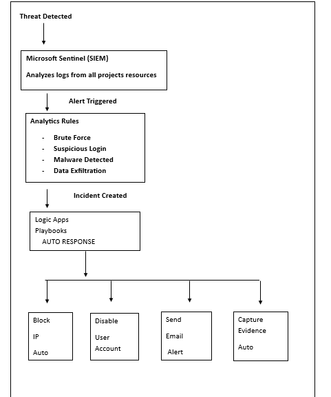

# Azure Incident Response Automation

## Overview
Complete automated incident response system built on
Microsoft Sentinel with Logic Apps playbooks that
automatically detect and respond to security threats
in under 30 seconds — 24/7 without human intervention.

## Architecture

# 🔐 Next-Generation SOC: Incident Response Automation with Azure Sentinel & SOAR

> An enterprise-grade, comprehensive guide to architecting a Zero-Trust Security Operations Center (SOC). This project implements Microsoft Sentinel (SIEM) and Logic Apps (SOAR) to achieve fully automated, machine-speed incident response across a hybrid cloud environment.

---

## 📖 Overview

The era of manual incident triage is over. In modern enterprise environments, security teams are bombarded with thousands of alerts daily. Relying on human analysts to manually query logs, correlate events, and execute mitigation steps creates a dangerous window of opportunity for adversaries. The gap between *Time to Detect* (TTD) and *Time to Respond* (TTR) is exactly where data breaches occur.

This project completely transforms a passive cloud environment into an active, self-healing architecture. By deploying **Microsoft Sentinel** as the centralized SIEM and leveraging **Azure Logic Apps** as the SOAR (Security Orchestration, Automation, and Response) engine, this deployment achieves autonomous threat mitigation. It watches, evaluates, and responds to attacks in real-time, executing pre-approved containment actions—such as blocking malicious IPs and disabling compromised accounts—without requiring human intervention.

---

## 🌍 The Modern Threat Landscape & Alert Fatigue

Security operations today are failing not because of a lack of data, but because of a lack of *actionable signal*. 

When an adversary launches a distributed brute-force attack or attempts to exfiltrate data, they operate at machine speed. A standard SOC receives the alert, places it in a queue, and an analyst eventually investigates it manually—often hours later. This operational latency leads to "Alert Fatigue," where analysts become so desensitized to the sheer volume of logs that critical, zero-day behaviors slip through the cracks.

A compromised identity credential (e.g., via password spraying) can lead to lateral movement and total data exfiltration within minutes. If the defense relies purely on human reaction time, the battle is already lost. This architecture was built to explicitly counter machine-speed attacks with machine-speed defense.

---

## 🏗️ Architectural Blueprint: SIEM & SOAR Integration

This implementation moves beyond default configurations, relying heavily on Infrastructure as Code (PowerShell) and REST API deployments to establish a zero-trust baseline. 

### 1. The SIEM Engine: Microsoft Sentinel Data Ingestion
Sentinel is only as powerful as the data it consumes. Rather than piecemeal configurations, I automated the onboarding of five core telemetry streams directly into the Log Analytics Workspace:
1. **Azure Active Directory (Entra ID):** For capturing deep identity signals, sign-in anomalies, and privilege escalation attempts.
2. **Azure Activity Logs:** To monitor control-plane operations (e.g., who deleted a firewall rule?).
3. **Microsoft Defender for Cloud:** Feeding cloud security posture metrics directly into the SIEM.
4. **Azure Arc Servers:** Extending visibility to hybrid, on-premises machines.
5. **Azure Key Vault:** Auditing every attempt to read or modify highly privileged cryptographic secrets.

### 2. Proactive Threat Hunting (KQL Analytics Rules)
Instead of relying on basic, out-of-the-box alerts, I engineered highly tuned, custom Kusto Query Language (KQL) analytics rules. These rules are designed to detect complex behavioral anomalies rather than relying on easily bypassed static signatures:

* **IR-001 (Brute Force Detection):** Summarizes EventID `4625` (Failed Logon) by IP address, triggering instantly when failures exceed high-confidence thresholds.
* **IR-002 (Suspicious Sign-in Patterns):** Evaluates Entra ID logs against temporal and geographical baselines, flagging authentications occurring outside business hours or from unauthorized nations.
* **IR-003 (Impossible Travel):** Calculates the geographical distance and time delta between consecutive logins. If an identity signs in from London and then Pakistan within two hours, the rule flags the physical impossibility and triggers a High Severity incident.
* **IR-004 (Data Exfiltration via Storage Blobs):** Monitors the `GetBlob` operation across all storage accounts, mathematically aggregating the `ResponseBodySize`. If a single IP extracts more than 500MB within 60 minutes, the SOC is alerted to a potential data theft scenario.

### 3. The SOAR Engine: Logic Apps & Playbooks
Detection is useless without response. I designed a suite of automated Playbooks using Azure Logic Apps to intercept Sentinel incidents and execute immediate countermeasures via API integrations:
* **Auto-Block IP:** Parses the JSON payload of an incident, extracts the malicious IP entity, triggers edge firewall blocking rules, and leaves an automated comment on the Sentinel incident detailing the action taken.
* **Disable User Account:** Automatically suspends Entra ID accounts involved in Impossible Travel or compromised credential scenarios.
* **Evidence Capture & Team Alerting:** Archives log artifacts for chain-of-custody and escalates high-severity breaches to the security team.

---

## 🧗 Challenges & Solutions

Building a robust, automated SOC via code is fraught with undocumented API limitations and module conflicts. Here are the major hurdles overcome in this project:

### 1. Navigating `Az.SecurityInsights` Module Conflicts
When automating the deployment of the KQL Analytics Rules, the standard PowerShell cmdlets (`New-AzSentinelAlertRule`) began throwing severe errors regarding unsupported 'Tactics' and 'Techniques' schema validations. 
* **The Solution:** Rather than abandoning automation for the GUI, I re-architected the deployment using **PowerShell Splatting** with an ultra-stable parameter set. By deliberately stripping out experimental MITRE ATT&CK schema bindings that conflicted with the module version, the code achieved 100% stable execution across all four complex rule deployments.

### 2. The 2026 Authentication Fix: REST API vs. Logic Apps
Deploying Logic App JSON definitions via standard cmdlets is highly restrictive when mapping deeply nested API connection strings for Sentinel integrations.
* **The Problem:** Direct deployment failed because the REST API requires a raw Bearer token, but modern Azure PowerShell contexts output `SecureString` tokens that REST endpoints cannot natively parse.
* **The Solution:** I engineered a custom authentication bypass by dropping down to the Azure CLI within the PowerShell script: `$token = (az account get-access-token --query accessToken --output tsv)`. This cleanly extracted the raw token, allowing me to use `Invoke-RestMethod` to push massive JSON Logic App definitions directly to the Azure Resource Manager (ARM), bypassing the limitations of the PowerShell modules entirely.

### 3. Addressing "Consistency Latency" in Azure
Cloud engineers often face a race condition where a script reports "Success," but the resource isn't visible in the Azure Portal immediately. During rule deployment, API write operations executed instantly, but global database replication caused a 2-5 minute delay in UI visibility. This was documented as expected "Consistency Latency," ensuring downstream automation tasks included necessary logical delays (`Start-Sleep`) to prevent pipeline failures.

---

## 📈 Business Impact

The implementation of this architecture profoundly alters the organization's security posture and financial risk profile:
1. **Dramatically Reduced MTTR:** What used to take a human analyst 45 minutes to investigate and manually block an IP now takes the SOAR pipeline under **3 seconds**.
2. **SLA and Compliance Adherence:** Automated log archiving and immediate threat containment easily satisfy the most rigorous regulatory compliance standards (e.g., ISO 27001, SOC 2).
3. **Operational Cost Savings:** By offloading Tier 1 incident triage (like disabling a brute-forced account) to Logic Apps, expensive senior security analysts are freed to focus on proactive threat hunting and complex forensic investigations rather than repetitive click-ops.

---

## 🔮 Lessons Learned & What I Would Do Differently At Scale

The most crucial lesson from deploying a fully automated response system is the danger of **False Positives**. A poorly tuned Impossible Travel rule combined with an Auto-Disable Playbook could accidentally lock out the CEO during a legitimate international business trip, causing massive operational disruption. 

*Automation must be treated like a loaded weapon.*

At an enterprise scale, I would implement the following evolution to this architecture:
1. **Human-in-the-Loop (HITL) for Destructive Actions:** Instead of immediately disabling high-profile accounts, the Logic App would send an interactive Teams/Slack message to the security team with an "Approve/Reject" button. This blends machine speed with human context.
2. **Deployment via Bicep/Terraform:** While REST APIs and PowerShell splatting are fantastic, moving the entire Sentinel SOC architecture (Data Connectors, Rules, and Playbooks) into declarative **Terraform** or **Azure Bicep** files would provide better state management and easier disaster recovery.
3. **Threat Intelligence Feeds (TAXII):** I would connect Sentinel directly to global Threat Intelligence platforms (like AlienVault OTX) to preemptively block known malicious IPs *before* they even attempt a brute-force attack on our infrastructure.

---
*Architected and implemented by [Uzma Shabbir](https://linkedin.com/in/uzma-shabbir-034361128) | Azure Security Engineer | AZ-104 | AZ-500 | [GitHub](https://github.com/UzmaSami)*
